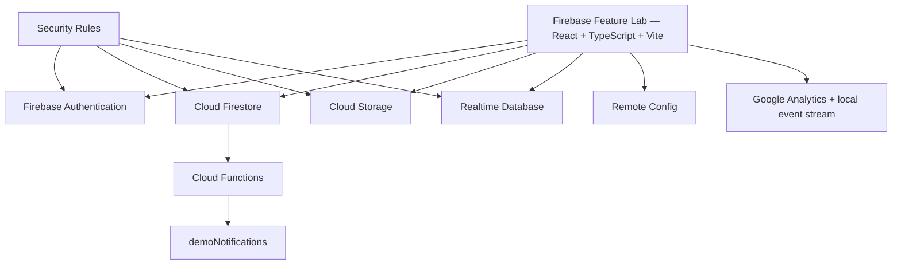

# Firebase Feature Lab

Interactive Firebase demos for web applications — built for the "Firebase:
Core Features and 2026 Platform Update" presentation. Each Firebase product
gets its own page with exactly four sections (What it is / Interactive demo
/ How it works / Practical use cases), a truthful status badge, an
architecture diagram, and a live event/result panel — so a presenter can
open any page independently, explain it, run one small demo, and move on.

## 1. Status system — read this first

Every feature page shows one of four labels, and the app is built so these
can never lie:

| Label | Meaning |
|---|---|
| **Live Firebase Integration** | Real Firebase SDK calls against your actual project |
| **Demo Data / Simulation** | A genuine interactive fallback (localStorage + BroadcastChannel), clearly not touching Firebase |
| **Optional Setup Required** | The product is optional/unverifiable from the client (e.g. Cloud Functions deployment) |
| **Not Configured** | Neither a live integration nor a demo is available yet |

A page whose interactive demo hasn't been built yet always renders the
shared placeholder (`FeatureComingSoonPage`) and always reports **Not
Configured** — the status shown on the Overview grid and the sidebar comes
from the exact same `computeFeatureStatus()` function the page itself uses
(see `src/lib/featureStatus.ts` + `src/lib/implementedFeatures.ts`), so the
grid can never claim a feature is "live" while the page underneath is just
a placeholder.

## 2. Which pages are real vs. placeholder

| Route | Status | What's real |
|---|---|---|
| `/authentication` | ✅ Implemented | Google + email/password sign-in, registration, sign-out, local demo-identity fallback |
| `/firestore` | ✅ Implemented | Real-time shared notes (`demoNotes`), localStorage+BroadcastChannel fallback |
| `/storage` | ✅ Implemented | PDF/PNG/JPEG upload with progress, `demoUploadMetadata`, simulated-upload fallback |
| `/realtime-database` | ✅ Implemented | Live reaction counter, transaction increment, local fallback |
| `/functions` | ✅ Implemented | Real Firestore-triggered Cloud Function (`onFunctionDemoCreated`), honest timeout if not deployed |
| `/notifications` | ✅ Implemented | Real-time `demoNotifications` list, self-serve send, mark-as-read, optional FCM opt-in |
| `/remote-config` | ✅ Implemented | Real `fetchAndActivate`, local A/B override fallback |
| `/analytics` | ✅ Implemented | Local cross-page event stream (see `src/lib/eventLog.ts`), Analytics SDK availability check |
| `/ab-testing` | ✅ Implemented | Explains Remote Config + Analytics → A/B Testing; sample completion-rate comparison; demo-mode-only local variant preview (never writes to Remote Config) |
| `/ai-logic` | ⏳ Placeholder | Not built yet |
| `/app-check` | ⏳ Placeholder | Not built yet |
| `/error-monitoring` | ⏳ Placeholder | Not built yet |
| `/hosting` | ⏳ Placeholder | Not built yet |
| `/updates-2026` | ⏳ Placeholder | Not built yet |

## 3. Architecture



Tech stack: React 19 + TypeScript (strict), Vite, Tailwind CSS v4, React
Router 7, Firebase Web SDK (modular API), Cloud Functions v2 (TypeScript),
vitest + `@firebase/rules-unit-testing` for rules tests.

## 4. Local setup

```bash
cd studyflow-ai
npm install
cp .env.example .env.local   # fill in your Firebase web config
npm run dev
```

The app runs fully even with a blank `.env.local` — every page falls back
to its labelled local simulation instead of crashing.

## 5. Environment variables

See `.env.example`. The 7 core `VITE_FIREBASE_*` keys plus
`VITE_FIREBASE_DATABASE_URL` (only needed for the Realtime Database demo)
control whether each page runs live or in simulation. None of these are
secrets — they identify the project, not grant access — but `.env.local`
stays git-ignored regardless. Never put a server-only secret in a `VITE_*`
variable; those ship in the client bundle.

## 6. Firebase Console setup checklist

Verified state as of the last inspection (`npx firebase projects:list`,
`npx firebase firestore:databases:list`, `npx firebase database:instances:list`):

- ✅ Firestore database exists (Native mode), rules + indexes deployed
- ✅ Storage bucket exists, rules deployed
- ✅ Realtime Database instance exists — **rules not yet deployed** (see §9)
- ❌ Cloud Functions — project is on the **Spark (free) plan**; deploying
  functions requires upgrading to **Blaze (pay-as-you-go)** at
  `console.firebase.google.com/project/<project-id>/usage/details`
- ❓ Authentication providers (Google, Email/Password) — enable under
  Authentication → Sign-in method if sign-in fails with "provider not
  enabled" (the Authentication page shows this exact message when it happens)

## 7. Firebase Emulator Suite & rules tests

```bash
npm run test:rules
```

This one command is fully self-contained: it starts the Firestore, Storage,
and Realtime Database emulators via `firebase emulators:exec`, runs every
test under `tests/rules/`, and shuts the emulators back down automatically
— it never leaves a long-running process behind. Current result: **49/49
passing** across `tests/rules/firestore.rules.test.ts`,
`tests/rules/storage.rules.test.ts`, and `tests/rules/database.rules.test.ts`.

To run the app itself against the emulators (rather than the real project),
add the four `connect*Emulator()` calls to `src/services/firebase.ts` behind
an env flag — not wired up by default, to keep that module simple.

## 8. Live vs. fallback behavior, per page

Every page follows the same pattern: real Firebase read/write only happens
when (a) the relevant product is configured **and** (b) the user is
actually signed in with real Firebase Authentication. If Firebase is
configured but the user hasn't signed in, the page shows an inline
"Sign in on the Authentication page" prompt and **blocks the action** — it
never silently falls back to the local simulation just because someone
isn't signed in yet (that would misrepresent a "Live Firebase Integration"
page as actually writing to Firebase when it isn't). The local
simulation only activates when Firebase itself isn't configured at all.

- **Authentication** — local fallback is a labelled demo-identity selector
  (Student/Teacher/Admin), never real auth.
- **Firestore / Storage / Realtime Database / Notifications** — local
  fallback uses `localStorage` + `BroadcastChannel`. Note: `BroadcastChannel`
  never delivers a message back to the tab that sent it, so each fallback
  also notifies same-tab listeners directly — otherwise the tab you
  actually clicked "Add note" in would never see its own new note.
- **Remote Config** — local fallback is a manual A/B toggle that only
  changes what the page displays, never the real parameter.
- **Cloud Functions** — no fallback exists (a Cloud Function cannot be
  honestly simulated client-side). The page always attempts a real write +
  listen, with a 20-second honest timeout if nothing responds.

## 9. Security Rules

- `firestore.rules` — default-deny; one `match` block per Feature Lab
  collection (`users`, `demoNotes`, `demoUploadMetadata`, `functionDemos`,
  `functionDemoResults`, `demoNotifications`, `demoAiChats`), explicit
  catch-all deny for everything else.
- `storage.rules` — default-deny; only `feature-lab/{uid}/uploads/{fileName}`
  is reachable, owner-only, content-type + size enforced server-side.
- `database.rules.json` — `featureLab/reactions/firebase` requires auth for
  read/write and validates the value is an integer in a sane range;
  `presence/{uid}` is owner-write-only.
- All three are covered by the automated tests in §7 (unauthenticated
  denied, cross-user denied, field-level validation enforced).

**Known gap:** the Realtime Database instance was created after
`database.rules.json` was last deployed, so the rules currently live on the
instance are unverified from this repo (could still be Firebase's own
default). Deploy `database.rules.json` to close this gap — see §11.

## 10. Deploying Firestore / Storage / Realtime Database rules

```bash
npx firebase deploy --only firestore:rules,firestore:indexes   # Firestore — already deployed, re-run after any rules/index change
npx firebase deploy --only storage                              # Storage — already deployed (note: no ":rules" suffix, see note below)
npx firebase deploy --only database                             # Realtime Database — NOT yet deployed, do this once confirmed
```

Note: `firebase deploy --only storage:rules` fails with "Could not find
rules for the following storage targets: rules" on current firebase-tools —
the `:rules` suffix is parsed as a *named deploy target*, which this project
doesn't define. Use plain `--only storage` instead.

## 11. Deploying Functions

```bash
cd functions && npm install && cd ..
npx firebase deploy --only functions
```

Requires the Blaze plan (see §6). `functions/` builds clean and the
`onFunctionDemoCreated` trigger is verified against the Functions +
Firestore emulator (event → result document → notification document, all
observed correctly).

## 12. Deploying Hosting

```bash
npm run build
npx firebase deploy --only hosting
```

`firebase.json` already rewrites every route to `index.html` for React
Router.

## 13. Known limitations

- Admin access (where it appears in retired code) is a Firestore field, not
  a custom claim — see comments at the top of `firestore.rules`.
- Storage Rules' teacher-style cross-user read pattern (if ever reintroduced)
  costs two extra Firestore reads per request — documented in `storage.rules`.
- Crashlytics has no supported web SDK — `/error-monitoring` (once built)
  must use the React Error Boundary + structured logger fallback and say so
  explicitly.
- Not every 2026 Firebase feature is GA — label each as configured,
  optional, preview, or not configured rather than assuming availability.

## 14. Presentation notes

- `slides.md` in the parent `topic_presentation/` directory is the Marp
  slide deck for this presentation (`npx @marp-team/marp-cli slides.md --pdf`).
- Each feature page's own "Interactive demo" section includes its own
  two-tab presentation tip where relevant (Firestore notes, Realtime
  Database reactions) — no separate backup script needed.
