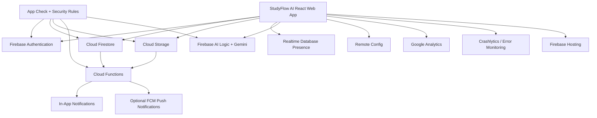

# StudyFlow AI

A small, presentation-ready learning platform built to demonstrate Firebase
products working together for **Firebase: Core Features and 2026 Platform
Update**. It is intentionally small — the goal is a reliable live demo, not
a full LMS.

## 1. Project overview and presentation purpose

StudyFlow AI walks through one connected user journey:

```text
Open deployed web app → Sign in → View learning dashboard
  → Ask AI Study Assistant → Upload assignment
  → Cloud Function automates teacher notification
  → Teacher creates announcement → Student sees in-app notification
  → Admin demonstrates Remote Config UI change
  → Explain Analytics, Crashlytics, security, A/B Testing, and Hosting
```

Every screen in the app is built to make the Firebase product behind it easy
to point to and explain during a live talk.

## 2. Features mapped to Firebase services

| Feature | Firebase product |
|---|---|
| Sign-in (Google + email/password) | Firebase Authentication |
| Courses, assignments, submissions, announcements, notifications, AI chat history | Cloud Firestore |
| "Students online" card | Realtime Database (optional) |
| Assignment PDF upload | Cloud Storage |
| Teacher/student notification automation | Cloud Functions (2nd gen) |
| AI Study Assistant | Firebase AI Logic + Gemini |
| Backend/AI request verification | App Check |
| Event logging (`login`, `quiz_started`, …) | Google Analytics |
| Error capture | React Error Boundary + structured logger (Crashlytics fallback — see §13) |
| Quiz CTA variant, upload size limit, maintenance message | Remote Config |
| Quiz page comparison card | A/B Testing (demo/sample values) |
| Optional push notifications | Firebase Cloud Messaging |
| Production hosting | Firebase Hosting |

Full breakdown also available in-app at `/about-firebase`.

## 3. Architecture diagram



## 4. Local setup

Requires Node.js 20+ and npm.

```bash
cd studyflow-ai
npm install
cp .env.example .env.local   # fill in your Firebase web config
npm run dev
```

The app runs fully even with an empty `.env.local` — every page shows a
clear "Firebase is not configured" banner and empty states instead of
crashing, so you can preview the UI before a project exists.

## 5. Firebase Console setup checklist

1. **Create the project.** Create a Firebase project (e.g. `studyflow-ai`),
   add a Web app, and copy its config into `.env.local`.
2. **Authentication.** Enable the Google and Email/Password providers.
   Create (or sign in once to create) three users that will become your
   Student, Teacher, and Admin demo accounts.
3. **Firestore.** Create a database in Native mode, in a region close to
   your presentation location. Deploy `firestore.rules` before demoing —
   never leave it in test mode.
4. **Storage.** Enable the default bucket, then deploy `storage.rules`.
5. **Realtime Database** (optional — only if you want the "students online"
   card). Create the database and deploy `database.rules.json`.
6. **Cloud Functions.** Requires the Blaze (pay-as-you-go) plan. Deploy from
   `functions/` (see §10).
7. **Firebase AI Logic.** Enable it for your project via the Firebase
   Console's "AI Logic" section (Gemini Developer API backend). No extra
   frontend API key is needed — StudyFlow AI calls it through the Firebase
   Web SDK (`firebase/ai`), scoped by the signed-in user and App Check.
8. **App Check.** Register a reCAPTCHA v3 site key, put it in
   `VITE_APP_CHECK_SITE_KEY`, and register your app's debug token for local
   development (see §13).
9. **Remote Config.** Create the four parameters listed in §12.
10. **Analytics.** Confirm it's enabled for the project (usually on by
    default for new projects).
11. **Hosting.** See §11.

## 6. Environment variables

Copy `.env.example` to `.env.local` and fill in the values from your
Firebase project's Web app config (Project settings → General → Your apps).
None of these are secret — they identify the project, not grant access —
but `.env.local` is still git-ignored to keep per-developer values out of
version control. **Never** put a server-only secret in a `VITE_*` variable;
those are bundled into the client JavaScript.

## 7. Firebase Emulator Suite

For local development without touching production data:

```bash
npm install -g firebase-tools   # one-time
firebase login
firebase init                    # if you haven't run this yet; point at this repo
firebase emulators:start
```

The emulator UI runs at `http://localhost:4000` by default (Auth 9099,
Firestore 8080, Functions 5001, Storage 9199, Realtime DB 9000, Hosting
5000 — see `firebase.json`). Point the app at the emulators during
development by connecting the SDKs in `src/services/firebase.ts` with the
`connect*Emulator` helpers if you want emulator-backed local dev (not
wired by default, to keep the service module simple — add the four
`connect*Emulator` calls there, gated by an env flag, if you need this).

## 8. Configuring Authentication providers

In the Firebase Console: **Authentication → Sign-in method** → enable
**Google** and **Email/Password**. For Google Sign-in on a deployed URL,
add that URL to the OAuth authorized domains list.

## 9. Deploying Firestore / Storage / Realtime Database rules

```bash
firebase deploy --only firestore:rules,storage:rules,database
```

Review `firestore.rules` and `storage.rules` first — both files have
inline comments explaining every access-control assumption, including the
demo-mode simplifications called out in §14.

## 10. Deploying Functions

```bash
cd functions
npm install
cd ..
firebase deploy --only functions
```

Two functions are implemented (2nd gen, TypeScript):

- **`onSubmissionCreated`** (`functions/src/submissions.ts`) — fires on
  `submissions/{submissionId}` create, looks up the course's teacher, and
  writes them a notification. Uses a deterministic notification document ID
  so a retried event doesn't create a duplicate.
- **`onAnnouncementCreated`** (`functions/src/announcements.ts`) — fires on
  `announcements/{announcementId}` create, and batch-writes one unread
  notification per enrolled student.

Local testing: `cd functions && npm run serve` runs the Functions +
Firestore + Auth emulators together.

## 11. Deploying Hosting

```bash
npm run build
firebase deploy --only hosting
```

`firebase.json` already rewrites every route to `index.html` so React
Router's client-side routes work on a hard refresh or direct link.

## 12. Configuring Remote Config

Create these four parameters in **Remote Config** (Firebase Console):

| Parameter | Default |
|---|---|
| `quiz_cta_variant` | `A` |
| `ai_assistant_enabled` | `true` |
| `maintenance_message` | *(empty string)* |
| `max_upload_size_mb` | `10` |

The app also ships these as in-code defaults (`src/services/remoteConfigService.ts`),
so it degrades gracefully if Remote Config is unreachable. For the
presentation, prepare a `quiz_cta_variant = "B"` value ahead of time so you
can demonstrate a live refresh.

## 13. Configuring AI Logic, App Check, Analytics, FCM, Crashlytics

- **AI Logic** — enabled per-project in the Firebase Console; no extra
  frontend secret required. `src/services/aiService.ts` fails safely (shows
  the required fallback message) if the project isn't configured.
- **App Check** — set `VITE_APP_CHECK_SITE_KEY` to a reCAPTCHA v3 site key.
  In development, `VITE_DEMO_MODE=true` sets `FIREBASE_APPCHECK_DEBUG_TOKEN`
  so you can register a debug token in the Console instead of solving a
  captcha locally. **Do not enable App Check enforcement in the Console
  until you've verified legitimate traffic works** — see
  `src/services/appCheckService.ts`.
- **Analytics** — enabled automatically once Firebase is configured;
  `src/services/analyticsService.ts` checks `isSupported()` before logging
  so it never throws in unsupported environments.
- **FCM (optional)** — set `VITE_FCM_VAPID_KEY`, generate a Web Push
  certificate in Console → Cloud Messaging, and replace the placeholder
  config values in `public/firebase-messaging-sw.js` with your real Firebase
  web config (safe to hardcode — not secrets). Push permission is requested
  only when a user clicks "Enable push notifications" on `/notifications`.
- **Crashlytics** — **not currently available for web** as a supported
  Firebase SDK. Rather than fabricate an integration, StudyFlow AI ships the
  documented fallback: a React `ErrorBoundary`
  (`src/components/ErrorBoundary.tsx`) plus a structured error logger
  (`src/services/errorReportingService.ts`). `/demo-error` triggers a
  controlled test error so you can show the fallback UI live. If/when
  Firebase ships a supported web Crashlytics SDK, swap
  `CRASHLYTICS_WEB_SUPPORTED` to `true` and wire the real SDK into
  `errorReportingService.ts` — every call site already goes through that
  one module.

## 14. Demo accounts and seeded data

1. Create three Firebase Authentication users (or sign in once through the
   app to create them) for Student, Teacher, and Admin.
2. Set each user's Firestore role: `users/{uid}.role = "student" | "teacher" | "admin"`
   (the app creates this document automatically on first sign-in, defaulted
   to `"student"` — change `teacher`/`admin` manually in the Firestore
   Console, or promote via the `scripts/seed.ts` script below).
3. Edit `scripts/seed.ts`, replacing the three `REPLACE_WITH_*_UID`
   constants with your real UIDs.
4. Set `GOOGLE_APPLICATION_CREDENTIALS` to a service account key with
   Firestore access, then run:

   ```bash
   npm run seed
   ```

This seeds two courses (`SE101`, `CLOUD201`), two assignments, one
announcement, and a welcome notification for the student account — enough
to run the full presentation script below without live data entry.

For the **role switcher** (visible only when `VITE_DEMO_MODE=true`): it
lets a presenter preview a different dashboard in the same browser tab. It
is a UI-only simulation — it never changes real Firebase Authentication or
Security Rules access; those still depend entirely on the signed-in user's
real `role` field.

## 15. Presentation script

1. Open the deployed StudyFlow AI landing page.
2. Sign in as the Student demo user.
3. Show dashboard course data and the upcoming assignment.
4. Open the AI Study Assistant; ask "Explain Firebase Cloud Functions in
   simple English."
5. Upload the prepared small PDF to an assignment.
6. Switch to the Teacher account (second browser profile).
7. Show the generated submission notification and the new submission.
8. Create the prepared teacher announcement.
9. Switch back to Student; show the in-app notification update.
10. Open the Quiz page; show the Remote Config-selected CTA variant.
11. Open the Admin Dashboard; show Firebase service status and demo metrics.
12. Show `/about-firebase`.
13. Return to slides for 2026 updates and conclusion.

## 16. Backup plan

Prepare before presenting:

- A second browser profile (or Incognito window) signed in as Teacher.
- A small test PDF under 1 MB.
- Screenshots of: Firestore data, a Storage file, Function logs, Analytics
  DebugView, and Remote Config parameters.
- A 1–2 minute screen recording of the full successful flow.
- A stable deployed URL tested on the presentation room's network.
- A local dev fallback (`npm run dev`) with seeded data, in case the network
  or deployed URL fails.

## 17. Security warnings and known limitations

- **Admin role is a Firestore field, not a custom claim.** For this demo,
  `users/{uid}.role == "admin"` grants admin access in Firestore rules. A
  user can never write their own `role` field (only an existing admin can
  change someone else's), so this isn't wide open — but for a real
  production deployment, replace it with a Firebase Authentication **custom
  claim** (`request.auth.token.admin`), set server-side via the Admin SDK,
  which a client can never modify at all. See the comments at the top of
  `firestore.rules`.
- **Storage Rules teacher access costs two extra Firestore reads per
  request** (`firestore.get()` calls to resolve assignment → course →
  teacher). This is documented in `storage.rules`; a production system
  should mirror `teacherId` into the uploaded object's custom metadata
  instead, or gate file access behind a callable Cloud Function.
- **Crashlytics is not available for web** in the current Firebase SDK —
  see §13 for the documented fallback and how to upgrade later.
- **The demo role switcher never grants real access.** It's a client-side
  UI simulation, gated behind `VITE_DEMO_MODE`, and must never be shipped
  as `true` in a real production deployment.
- **`aiChats` documents store only prompt + response** — no other user
  data, keeping the AI feature's Firestore footprint minimal.
- **Not every 2026 Firebase feature is GA.** This app and its presentation
  script label each integration as configured, optional, preview, or not
  configured — never assume general availability of an announced feature.
